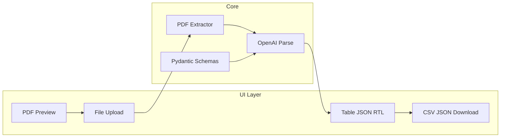

# AI Document Intelligence Demo — Implementation Plan

## Architecture (high level)



---

## 1. Project setup

**Goals:** Python 3.10+, isolated dependencies, secrets via `.env`, runnable app entrypoint.

| Step | Action |
|------|--------|
| 1.1 | Create [`requirements.txt`](c:\Users\eylak\OneDrive - post.bgu.ac.il\Desktop\programming\doc_classifier\requirements.txt): `streamlit`, `openai`, `pydantic>=2`, `python-dotenv`, `pymupdf` (primary PDF library per your stack; optional `pdfplumber` only if a sample PDF fails with fitz). |
| 1.2 | Add [`.env.example`](c:\Users\eylak\OneDrive - post.bgu.ac.il\Desktop\programming\doc_classifier\.env.example) with `OPENAI_API_KEY=` and short comments; document copying to `.env` (gitignore `.env`). |
| 1.3 | Optional [`README.md`](c:\Users\eylak\OneDrive - post.bgu.ac.il\Desktop\programming\doc_classifier\README.md): one command to run (`streamlit run app/streamlit_app.py` or `streamlit run app.py` — match chosen structure below). |
| 1.4 | Align with workspace rules: type hints, Pydantic v2, `logging` logger (no `print` in core modules), OpenAI client as instance, `load_dotenv()` at startup. |

**PDF library choice:** Start with **PyMuPDF (`fitz`)** — good performance and text extraction; if Hebrew appears corrupted on real samples, try `page.get_text("text")` vs `"dict"`, or fallback to pdfplumber for that file only (plan-level: implement one clear path first, document fallback hook in `extractor.py`).

---

## 2. Suggested directory structure

Keep Streamlit thin; business logic in importable modules.

```text
doc_classifier/
  app/
    streamlit_app.py      # UI only: widgets, layout, session state, progress
  src/
    doc_intel/
      __init__.py
      models.py           # Pydantic models: Invoice, Contract, enums, wrapper types
      extractor.py        # PDF → str (UTF-8 safe pipeline)
      prompts.py          # System/user prompt templates (Hebrew + ILS rules)
      openai_client.py    # Thin wrapper: parse() with model id, retries, logging
      pipeline.py         # Orchestrate: extract → classify doc type? → parse → result DTO
      export.py           # JSON + CSV serialization from list of results
      errors.py           # Custom exceptions (PDFError, ExtractionError, OpenAIError)
  .env.example
  requirements.txt
  .gitignore
```

**Alternative (flatter):** `app.py`, `models.py`, `processor.py` at repo root — acceptable for a tiny PoC, but the layout above scales better and keeps “UI vs logic” separation explicit ([.cursorrules](c:\Users\eylak\OneDrive - post.bgu.ac.il\Desktop\programming\doc_classifier\.cursorrules)).

---

## 3. Data models (`models.py`)

**Goals:** Single source of truth for Structured Outputs; support invoices/contracts; bilingual field content.

| Step | Action |
|------|--------|
| 3.1 | Define **document-type-specific** models, e.g. `InvoiceExtraction` with fields: vendor, invoice_date, total_amount, currency, tax_id, line_items (optional list), `confidence_notes` optional. `ContractExtraction`: parties, effective_date, key_terms summary, etc. Use `Field(description=...)` to guide the model. |
| 3.2 | Define a **union or discriminated wrapper**, e.g. `doc_type: Literal["invoice","contract"]` + nested `invoice: InvoiceExtraction | None`, `contract: ContractExtraction | None`, *or* separate API calls per type after quick classification — PoC can use **one combined schema with optional sections** or **two-step** (classify → parse). Recommend **two-step** for cleaner JSON: (1) short classification from excerpt, (2) `parse` into the specific Pydantic model. |
| 3.3 | Add a small **`ProcessingResult`** (non-Pydantic or Pydantic) for UI: `filename`, `success`, `structured: BaseModel | None`, `raw_text_preview`, `error_message`, `warnings` (e.g. truncated text). |

All string fields are **Unicode**; no special type for “Hebrew” — preservation is enforced in extraction + prompts, not in the schema.

---

## 4. Extraction logic

### 4.1 PDF text extraction (`extractor.py`)

| Step | Action |
|------|--------|
| 4.1.1 | Accept `bytes` or path; open with PyMuPDF; iterate pages; concatenate text with explicit `\n` page breaks. |
| 4.1.2 | **UTF-8 / mojibake:** Work in Python `str` (Unicode). After `get_text`, normalize with `unicodedata.normalize("NFC", text)` optional. If gibberish persists, log encoding/font issues and surface `warnings` (do not silently drop Hebrew). |
| 4.1.3 | **Truncation:** Cap extracted characters sent to the API (e.g. 12k–24k chars) with clear truncation message in `warnings` to control cost and context limits. |
| 4.1.4 | **Errors:** Catch PyMuPDF failures, empty extraction, password-protected PDFs → raise `PDFError` from [`errors.py`](c:\Users\eylak\OneDrive - post.bgu.ac.il\Desktop\programming\doc_classifier\src\doc_intel\errors.py) with user-safe messages. |

### 4.2 Prompts (`prompts.py`)

| Step | Action |
|------|--------|
| 4.2.1 | System + user messages: input = extracted text + optional filename. |
| 4.2.2 | **Explicit Hebrew / locale rules:** Preserve Hebrew **verbatim**; do not transliterate; recognize **ILS**, **₪**, and common Hebrew date formats where present; output structured fields in Unicode JSON matching the Pydantic schema. |
| 4.2.3 | English documents: same schema; language-agnostic instructions. |

### 4.3 OpenAI integration (`openai_client.py` + `pipeline.py`)

| Step | Action |
|------|--------|
| 4.3.1 | Instantiate `OpenAI()` with API key from environment; model **`gpt-4o-mini`** (configurable constant). |
| 4.3.2 | Use **`client.beta.chat.completions.parse`** with `response_format` from Pydantic model (`model_json_schema` / typed parse per OpenAI Python SDK v1 pattern). |
| 4.3.3 | **Classification step (if two-step):** `parse` into a tiny `DocumentKind` model or use a minimal completion; then second `parse` with the full schema for that kind. |
| 4.3.4 | **Retries:** 1–2 retries on transient errors (rate limit, 5xx) with exponential backoff; log full exception server-side, user sees generic “AI temporarily unavailable”. |
| 4.3.5 | **Failures:** Invalid API key, content policy, empty response → map to `OpenAIError` / `ExtractionError` with safe messages; never leak raw API bodies to UI. |

---

## 5. UI layer (`app/streamlit_app.py`)

| Step | Action |
|------|--------|
| 5.1 | **`st.file_uploader`**: `accept_multiple_files=True`, type `pdf`. |
| 5.2 | **Progress UX:** `st.status` or placeholders + `st.progress` / spinner steps: e.g. “Reading PDF…”, “Extracting text…”, “Consulting AI…”, “Formatting results…”. |
| 5.3 | **Side-by-side:** `st.columns(2)` — left: **PDF preview** via `st.pdf` (Streamlit built-in for uploaded bytes in recent versions) or `iframe` / base64 embed fallback; right: `st.dataframe` or `st.json` for structured output. |
| 5.4 | **Multi-language / RTL:** For Hebrew-heavy cells, render table column(s) using **HTML** (`st.markdown(unsafe_allow_html=True)`) with `dir="rtl"` and `unicode-bidi: plaintext` or wrap in `<div dir="rtl" style="text-align:right">...</div>` for preview snippets — test with real Hebrew strings. Avoid breaking JSON download (exports stay UTF-8; RTL is display-only). |
| 5.5 | **Export:** Buttons: **Download JSON** (pretty UTF-8), **Download CSV** (use `export.py`: flatten nested models for CSV, UTF-8 with BOM optional for Excel Hebrew). |
| 5.6 | **Session state:** Store list of `ProcessingResult` for batch export after multiple files. |
| 5.7 | **Errors:** `st.error` per file with friendly text; partial success when one of many PDFs fails. |

---

## 6. Error handling (summary)

| Scenario | Behavior |
|----------|----------|
| Corrupt / invalid PDF | Catch in extractor → `PDFError` → UI: clear message, skip AI call. |
| Empty or unreadable text | Warning + optional still call AI with disclaimer, or fail fast (choose one; recommend **fail fast** with message). |
| Password-protected PDF | Detect and message user. |
| OpenAI rate limit / timeout | Retry; then user-facing retry suggestion. |
| Schema parse mismatch | Log; show “extraction incomplete” and raw JSON if SDK exposes it safely. |

---

## 7. Implementation order (recommended)

1. Project skeleton + `.env` + `requirements.txt` + logging config.  
2. `models.py` + `errors.py`.  
3. `extractor.py` (PyMuPDF + UTF-8 normalization + truncation).  
4. `prompts.py` + `openai_client.py` + `pipeline.py` (parse path).  
5. `export.py`.  
6. `streamlit_app.py` (upload, progress, side-by-side, RTL display, downloads).  
7. Manual test: English PDF, Hebrew PDF, corrupt PDF, missing API key.

---

## 8. Out of scope for initial PoC (optional later)

- Batch async processing, persistent DB, user auth, non-PDF formats, automated tests CI.

---

**Confirmation:** After you approve this plan, implementation can proceed **incrementally** (e.g. setup + models first, then extractor, then OpenAI, then UI) without dumping all code at once.
